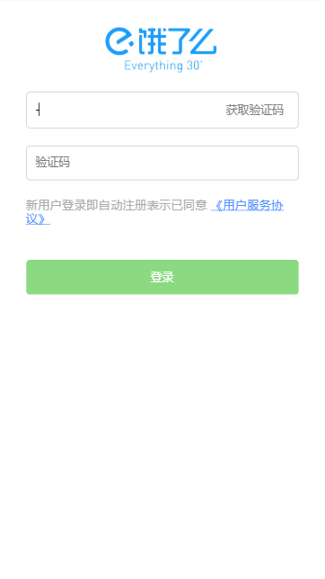
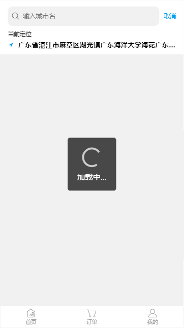
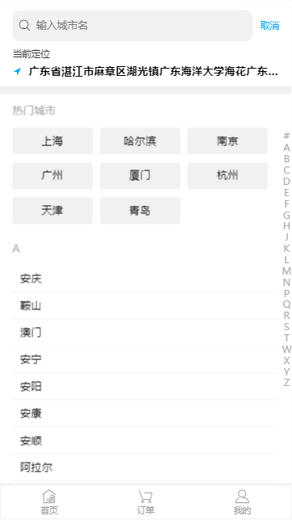

# vue全家桶  + better-scroll + axios 仿饿了么项目
该项目使用vue-cli3搭建，目前实现了手机号码登录、定位、搜索城市、搜索地址等功能。后续会完善更多功能。项目的部分组件使用mint-ui，例如swiper。为了获得更好的页面滚动体验，部分页面使用了[better-scroll]()插件。

## 项目截图
1.登录  

   

2.首页  
   

3.定位  
   

4.城市  
   

5.地址  

   

## 总结

第一次做移动端的项目，使用了百分比布局方法，页面适配程度一般。后期会转为更为流行的viewport布局方案。